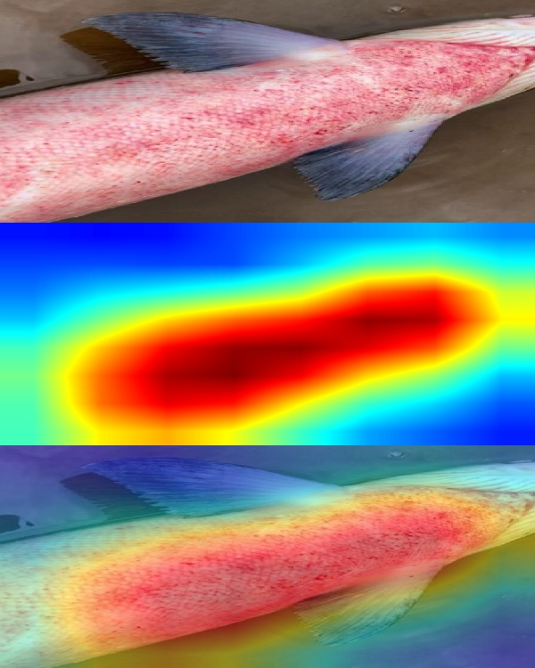

 This project focuses on identifying salmon fish diseases form images uisng convolutional neural network(CNN). 
 To make the model interpretable, I used Grad-cam to visualize the regions that influence predictions , able to see what the model "sees" to predict the disease.

 ## What This Project Does?
- Classifies Fish images as Fresh or Infected
- Explains predictions using Grad-CAM heatmaps
- Highlights infected areas in the images.
- Model accuracy achieves : ~ 93% validation accuracy

## Model Architecture
The cnn model is build using 9 Conv2D layers , interleaved with MaxPooling , followed by 2 Dense layers.

## Example using Grad-CAM
 

 Figure : Original image , Grad-Cam heatmap , Overlay Image (Top to Bottom)

As we can see, the infected area is prominently highlighted, indicating that the model focused on this region when making its prediction. As a result, it classified the fish as infected with ~98% confidence.

## Dataset Info

The dataset used in this project is sourced from SalmonScan, a curated collection of salmon fish images designed for disease identification in aquaculture. It provides high-resolution images of both healthy and infected salmon, making it ideal for training deep learning models on binary classification tasks. The model was trained on this dataset to distinguish between healthy and infected fish, achieving high accuracy and generalization performance.

Citation:

Ahmed, Md Shoaib (2024), “SalmonScan: A Novel Image Dataset for Machine Learning and Deep Learning Analysis in Fish Disease Detection in Aquaculture”, Mendeley Data, V3, https://doi.org/10.17632/x3fz2nfm4w.3

Thank you.